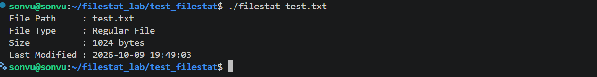
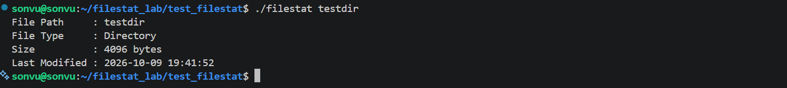
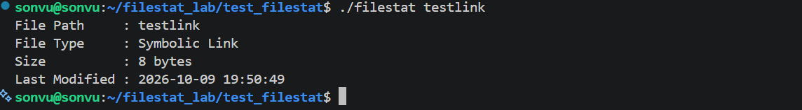
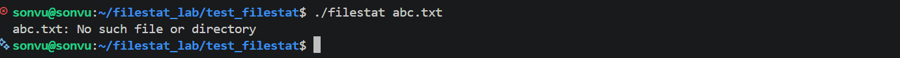
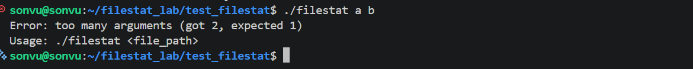

# BÁO CÁO THỰC TẬP: XÂY DỰNG CÔNG CỤ KIỂM TRA METADATA CỦA FILE (`filestat`)

- **Người thực hiện:** Sơn Vũ 
- **Mục tiêu:** Viết chương trình C `filestat` đọc metadata của một file, thư mục hoặc symbolic link bằng `lstat()` và `struct stat`, tương tự ở mức cơ bản với lệnh `stat`. Qua đó hiểu mối quan hệ giữa chương trình C, Linux API, filesystem và inode.

> Trạng thái tài liệu:
>- Phần A. Cơ sở lý thuyết.
>- Phần B. Bài làm thiết kế, mã nguồn, kiểm thử, trả lời câu hỏi, phần nâng cao
## Mục lục

1. [Tổng thể và luồng hoạt động](#1-tổng-thể-và-luồng-hoạt-động)
2. [Command-line arguments: `argc`, `argv`](#2-command-line-arguments-argc-argv)
3. [Linux filesystem, metadata và inode](#3-linux-filesystem-metadata-và-inode)
4. [`struct stat` và các hàm `stat()`, `lstat()`](#4-struct-stat-và-các-hàm-stat-lstat)
5. [Các trường quan trọng: `st_mode`, `st_size`, `st_mtime`](#5-các-trường-quan-trọng-st_mode-st_size-st_mtime)
6. [Xử lý lỗi: giá trị trả về, `errno`, `perror()`](#6-xử-lý-lỗi-giá-trị-trả-về-errno-perror)
7. [Biên dịch và chạy chương trình C trên Linux](#7-biên-dịch-và-chạy-chương-trình-c-trên-linux)

---

# PHẦN A. CƠ SỞ LÝ THUYẾT

## 1. Tổng thể và luồng hoạt động

Đề bài yêu cầu giải thích luồng:

```text
path  ->  lstat()  ->  kernel / filesystem cung cấp metadata  ->  struct stat  ->  chương trình phân tích và hiển thị
```

Hình dưới mô tả chi tiết hơn từng bước:

```text
 USER SPACE (chương trình)                     KERNEL SPACE
+----------------------------------+      +-------------------------------------------+
| $ ./filestat test.txt            |      |                                           |
|                                  |      |                                           |
| 1. main(argc, argv)              |      |                                           |
|    argv[1] = "test.txt"          |      |                                           |
|                                  |      |                                           |
| 2. struct stat sb;               |      |                                           |
|    lstat("test.txt", &sb) -------+--(1)-+--> 3. System call (chuyển sang kernel)    |
|                                  |      |       |                                   |
|                                  |      |       v                                   |
|                                  |      |    4. VFS (Virtual File System)           |
|                                  |      |       tìm tên "test.txt" trong thư mục    |
|                                  |      |       -> được số inode                    |
|                                  |      |       |                                   |
|                                  |      |       v                                   |
|                                  |      |    5. Filesystem cụ thể (ext4, ...)       |
|                                  |      |       đọc inode: loại, quyền, size, time  |
|                                  |      |       |                                   |
| 6. sb đã được điền đầy đủ  <-----+--(2)-+-------+ kernel sao chép kết quả vào sb     |
|                                  |      |                                           |
| 7. Phân tích sb.st_mode,         |      |                                           |
|    sb.st_size, sb.st_mtime       |      |                                           |
|    -> printf ra màn hình         |      |                                           |
+----------------------------------+      +-------------------------------------------+
 (1) đi vào kernel: truyền đường dẫn và địa chỉ của sb
 (2) trở về user space: lstat() trả 0 (thành công) hoặc -1 (lỗi, kèm errno)
```

Lưu ý:

1. **Chương trình  không tự đọc đĩa.** Nó nhờ kernel thông qua một **system call** (lời gọi hệ thống). Kernel mới có quyền truy cập filesystem và phần cứng.
2. **Metadata nằm ở inode**, không nằm trong nội dung file. `lstat()` chỉ đọc inode, **không mở và không đọc nội dung** của file.
3. **`struct stat` là “phiếu kết quả”** mà kernel điền vào vùng nhớ do chương trình cung cấp. Nếu `lstat()` thất bại, phiếu này **không đáng tin** và không được dùng.

>  `lstat()` trong `<sys/stat.h>` là hàm bọc (wrapper) của thư viện C (glibc) bao quanh system call. Trên glibc mới, hàm này thường dùng system call `newfstatat` ở bên dưới. Nếu máy có công cụ `strace` (cài bằng `sudo apt install strace`), bạn có thể quan sát bằng `strace ./filestat test.txt`.

---

## 2. Command-line arguments: `argc`, `argv`

### 2.1. Khái niệm

Khi gõ lệnh trong shell, các “từ” trong dòng lệnh được truyền cho chương trình qua hai tham số của `main`:

```c
int main(int argc, char *argv[])
```

| Tham số | Ý nghĩa |
|---------|---------|
| `argc` | **arg**ument **c**ount: số phần tử trong `argv`, **bao gồm cả tên chương trình** |
| `argv` | **arg**ument **v**ector: mảng các chuỗi, mỗi chuỗi là một đối số. `argv[0]` là tên chương trình, `argv[argc]` luôn là `NULL` |

### 2.2. Ví dụ

| Dòng lệnh | `argc` | `argv[0]` | `argv[1]` | `argv[2]` |
|-----------|:------:|-----------|-----------|-----------|
| `./filestat` | 1 | `"./filestat"` | (không có, `NULL`) | |
| `./filestat test.txt` | 2 | `"./filestat"` | `"test.txt"` | |
| `./filestat a b` | 3 | `"./filestat"` | `"a"` | `"b"` |

Vì `argc` đã tính cả tên chương trình, yêu cầu “nhận **chính xác một** tham số là đường dẫn” nghĩa là **`argc` phải bằng 2**. Điều kiện kiểm tra đúng là `argc != 2`, không phải `argc != 1`.

### 2.3.Kiểm tra và hướng dẫn sử dụng

```c
if (argc != 2) {
    fprintf(stderr, "Usage: %s <file_path>\n", argv[0]);
    return EXIT_FAILURE;
}
```

- Dùng `argv[0]` trong thông báo để tên chương trình luôn đúng dù người dùng gọi bằng đường dẫn nào.
- Thông báo lỗi và hướng dẫn nên ghi ra **`stderr`** (luồng lỗi chuẩn), không ghi ra `stdout`.
- Thoát bằng `EXIT_FAILURE` (giá trị khác 0) để shell và các chương trình khác biết lệnh đã thất bại. `EXIT_SUCCESS` (bằng 0) khi thành công. Hai hằng này nằm trong `<stdlib.h>`.

### 2.4. Những điều shell thực hiện trước khi chương trình chạy

Chương trình chỉ nhìn thấy kết quả **sau khi shell đã xử lý** dòng lệnh. Một số hệ quả cần biết:

| Dòng lệnh | Điều xảy ra | `argc` |
|-----------|-------------|:------:|
| `./filestat my file.txt` | Shell tách theo khoảng trắng thành hai đối số `my` và `file.txt` | 3 (bị báo “quá nhiều argument”) |
| `./filestat "my file.txt"` | Dấu nháy giữ nguyên thành một đối số `my file.txt` | 2 |
| `./filestat *.txt` | Shell mở rộng dấu `*` thành danh sách tất cả file khớp. Nếu có nhiều file, chương trình nhận nhiều đối số | số file + 1 |
| `./filestat` | Không có đối số | 1 (báo Usage) |


---

## 3. Linux filesystem, metadata và inode

### 3.1. “Mọi thứ đều là file”

 Hầu hết tài nguyên được biểu diễn như một file trong cây thư mục thống nhất bắt đầu từ `/`. Văn bản, thư mục, thiết bị phần cứng (`/dev/...`), thông tin hệ thống (`/proc/...`), đường ống, socket đều có thể được truy cập bằng cùng một nhóm API (`open`, `read`, `write`, `stat`...). Vì vậy một công cụ như `filestat` hữu ích để kiểm tra mọi loại đối tượng này.

### 3.2. Dữ liệu và metadata

Mỗi file có hai phần:

| Phần | Nội dung | Vị trí |
|------|----------|-----------|
| **Dữ liệu (data)** | Nội dung thật của file (chữ trong `test.txt`) | Các khối dữ liệu (data block) |
| **Metadata** (siêu dữ liệu) | **Thông tin về** file: loại, quyền, chủ sở hữu, kích thước, thời gian... | **inode** |

### 3.3. inode là gì?

> **inode** (index node) là cấu trúc dữ liệu của filesystem lưu **toàn bộ metadata của một file** và vị trí các khối dữ liệu của file đó. Mỗi inode có một **số inode** (inode number) duy nhất trong một filesystem.

Một inode lưu:

- Loại file (regular, directory, symlink...) và quyền truy cập (permission).
- Chủ sở hữu (`uid`) và nhóm (`gid`).
- Kích thước file.
- Các mốc thời gian: truy cập (atime), sửa nội dung (mtime), đổi trạng thái (ctime).
- Số liên kết cứng (link count).
- Con trỏ tới các khối dữ liệu.

**inode không lưu tên file.** Tên file nằm ở nơi khác.

### 3.4. Tên file nằm ở đâu? Thư mục là gì?

Một **thư mục (directory)** thực chất cũng là một file đặc biệt, nội dung của nó là từ tên sang số inode**. Mỗi dòng của bảng gọi là một **directory entry**.

```text
Thư mục /home/user/              inode 573510
+-----------------+-----------+  +--------------------------+
| tên             | số inode  |  | loại: regular file       |
+-----------------+-----------+  | quyền: rw-r--r--         |
| test.txt   -----+--> 573510 -+->| uid, gid: ...            |
| hard.txt   -----+--> 573510 -+->| size: 1024               |
| testlink   -----+--> 573517  |  | mtime, atime, ctime      |
| testdir    -----+--> 573512  |  | link count: 2            |
+-----------------+-----------+  | con trỏ -> các data block|
                                 +--------------------------+
```

Hệ quả quan trọng:

1. **Một file có thể có nhiều tên** (hard link): `test.txt` và `hard.txt` trong ví dụ trỏ cùng một inode. Chúng là **cùng một file**, nên cùng kích thước, cùng thời gian. Số liên kết (`st_nlink`) của inode đó là 2.
2. **Đổi tên hoặc di chuyển** file trong cùng filesystem chỉ sửa directory entry, **không đổi inode** và không chép dữ liệu.
3. Khi một chương trình gọi `lstat("test.txt", ...)`, kernel phải **tra tên trong thư mục để lấy số inode**, rồi mới đọc inode đó để lấy metadata.

### 3.5. Symbolic link và hard link

| | Hard link | Symbolic link (symlink) |
|---|-----------|-------------------------|
| Bản chất | Thêm một **tên mới** cho cùng inode | Một **file riêng** (inode riêng), nội dung là **chuỗi đường dẫn** tới đích |
| Lệnh tạo | `ln test.txt hard.txt` | `ln -s test.txt testlink` |
| Nếu xoá file gốc | File vẫn còn (đến khi hết mọi tên) | Link trở thành **“dangling”** (treo), trỏ vào chỗ không tồn tại |
| Trỏ qua filesystem khác | Không | Có |
| Trỏ tới thư mục | Thường không cho phép | Có |

Symbolic link giống một **biển chỉ đường**: bản thân biển là một vật riêng, nội dung biển ghi “đi tới `test.txt`”. 

### 3.6. Các mốc thời gian của file

| Tên | Trường trong `struct stat` | Cập nhật khi nào | Lệnh xem |
|-----|----------------------------|------------------|----------|
| **atime** (access) | `st_atime` | Nội dung file được **đọc** (tuỳ tuỳ chọn mount, mục dưới) | `ls -lu` |
| **mtime** (modify) | `st_mtime` | Nội dung file được **ghi/sửa** | `ls -l` (mặc định) |
| **ctime** (change) | `st_ctime` | **Trạng thái inode** thay đổi: ghi nội dung, đổi quyền, đổi chủ, đổi số link | `ls -lc` |


## 4. `struct stat` và các hàm `stat()`, `lstat()`

### 4.1. Prototype và header

```c
#include <sys/stat.h>      /* struct stat, stat(), lstat(), S_ISREG()... */
#include <sys/types.h>     /* mode_t, off_t, ino_t, time_t (thường đã có sẵn) */

int stat (const char *pathname, struct stat *statbuf);
int lstat(const char *pathname, struct stat *statbuf);
int fstat(int fd,               struct stat *statbuf);
```

| Hàm | Đối tượng được hỏi | Với symbolic link |
|-----|--------------------|-------------------|
| `stat()` | Đường dẫn | **Đi theo link**, trả metadata của **file đích** |
| `lstat()` | Đường dẫn | **Không đi theo link**, trả metadata của **chính link** |
| `fstat()` | File đã mở (file descriptor) | Làm việc trên file đã mở |

Giá trị trả về chung: **0** nếu thành công, **-1** nếu lỗi (lúc đó `errno` được đặt, xem mục 6). Đề bài dùng `lstat()` vì cần nhận diện được symbolic link

### 4.2. `struct stat` dùng để làm gì?

`struct stat` là cấu trúc để nhận kết quả metadata do kernel trả về. Chương trình khai báo một biến kiểu này rồi truyền địa chỉ của nó vào `lstat()`; kernel điền các trường vào. Sau đó chương trình đọc các trường để hiển thị.

```c
struct stat sb;                        /* vùng nhớ nhận kết quả */
if (lstat(path, &sb) == -1) {          /* truyền ĐỊA CHỈ của sb */
    /* xử lý lỗi, KHÔNG dùng sb */
}
/* chỉ đến đây mới được đọc sb.st_mode, sb.st_size ... */
```

### 4.3. Các trường chính của `struct stat`

| Trường | Kiểu | Ý nghĩa |
|--------|------|---------|
| `st_dev` | `dev_t` | Thiết bị chứa file |
| `st_ino` | `ino_t` | Số inode|
| `st_mode` | `mode_t` | Loại file và quyền truy cập | 
| `st_nlink` | `nlink_t` | Số hard link tới inode |
| `st_uid` | `uid_t` | ID chủ sở hữu |
| `st_gid` | `gid_t` | ID nhóm sở hữu |
| `st_rdev` | `dev_t` | Số hiệu thiết bị (với file thiết bị) |
| `st_size` | `off_t` | Kích thước tính bằng byte | 
| `st_atime` | `time_t` | Thời gian truy cập cuối | 
| `st_mtime` | `time_t` | Thời gian sửa nội dung cuối | 
| `st_ctime` | `time_t` | Thời gian đổi trạng thái inode cuối | 


### 4.4. `stat()` và `lstat()` khác nhau thế nào với symbolic link?

- `stat("testlink")` giống việc **đi theo biển** rồi mô tả toà nhà ở nơi biển chỉ tới.
- `lstat("testlink")` giống việc **mô tả chính cái biển**.

Kết quả thật khi gọi cả hai hàm trên cùng một đường dẫn (`test.txt` dài 1024 byte, `testlink -> test.txt`):

| Đường dẫn | `lstat()` | `stat()` |
|-----------|--------------------|-------------------|
| `test.txt` | regular, mode `0100644`, size 1024, inode 573510 | giống `lstat()` |
| `testlink` | **symlink**, mode `0120777`, **size 8**, inode **573517** | **regular**, mode `0100644`, **size 1024**, inode **573510** |
| `dangling` (trỏ tới file không tồn tại) | **symlink**, size 10, **thành công** | **lỗi** `No such file or directory` |
| `testdir` | directory, size 4096 | giống `lstat()` |

Lưu ý:
1. Nếu dùng `stat()`, **không bao giờ nhận ra được symbolic link**, vì nó luôn đi theo link và báo loại của file đích. Đề bài yêu cầu nhận diện Symbolic Link nên **bắt buộc dùng `lstat()`**.
2. `size = 8` của `testlink` đúng bằng độ dài chuỗi `"test.txt"` (8 ký tự): symlink là một file mà nội dung chính là đường dẫn đích (mục 5.3).
3. `lstat()` vẫn hoạt động với link “treo” (`dangling`), còn `stat()` thì lỗi. Công cụ kiểm tra file nên dùng `lstat()` để không bị lỗi khi gặp link hỏng.

### 4.5. Quyền cần có để gọi `lstat()`

`lstat()` **không cần quyền đọc, ghi hay thực thi trên chính file đích**. Nó chỉ cần quyền **tìm kiếm (search, bit `x`)** trên **mọi thư mục nằm dọc đường dẫn** để kernel đi qua được các thư mục đó.

---

## 5. Các trường quan trọng: `st_mode`, `st_size`, `st_mtime`

### 5.1. `st_mode`: loại file và quyền truy cập

`st_mode` là một trường trong `struct stat`, có kiểu `mode_t`.

Nó chứa hai thông tin quan trọng:

1. **Loại file**: đối tượng là file thường, thư mục, symbolic link, device, ...
2. **Quyền truy cập**: ai được đọc, ghi và thực thi đối tượng đó.

Có thể hình dung `st_mode` như sau:

```text
st_mode
   │
   ├── Loại file
   │     ├── Regular file
   │     ├── Directory
   │     ├── Symbolic link
   │     └── ...
   │
   ├── Bit đặc biệt
   │     ├── setuid
   │     ├── setgid
   │     └── sticky bit
   │
   └── Quyền truy cập
         ├── Owner
         ├── Group
         └── Others
```
---
### 5.2. `S_ISREG()`, `S_ISDIR()`, `S_ISLNK()` dùng để làm gì?

Đây là các **macro** dùng để **kiểm tra loại file** từ giá trị `st_mode`. Mỗi macro nhận `st_mode` và trả về:

- **Khác 0 (đúng)** nếu file thuộc loại đó.
- **Bằng 0 (sai)** nếu không.

Bên trong, mỗi macro làm hai việc: dùng `S_IFMT` để lấy ra phần loại file, rồi so sánh phần đó với hằng của loại cần kiểm tra:

```c
#define S_ISREG(m)  (((m) & S_IFMT) == S_IFREG)
#define S_ISDIR(m)  (((m) & S_IFMT) == S_IFDIR)
#define S_ISLNK(m)  (((m) & S_IFMT) == S_IFLNK)
```

Bảng các macro cùng nhóm:

| Macro | Kiểm tra | Hằng so sánh |
|-------|----------|--------------|
| `S_ISREG(m)` | Regular file | `S_IFREG` |
| `S_ISDIR(m)` | Directory | `S_IFDIR` |
| `S_ISLNK(m)` | Symbolic link | `S_IFLNK` |
| `S_ISCHR(m)` | Character device | `S_IFCHR` |
| `S_ISBLK(m)` | Block device | `S_IFBLK` |
| `S_ISFIFO(m)` | FIFO | `S_IFIFO` |
| `S_ISSOCK(m)` | Socket | `S_IFSOCK` |

---

### 5.3. `st_size`: kích thước của file

`st_size` là một trường trong `struct stat`, có kiểu `off_t`.
Nó cho biết kích thước của filesystem object theo **đơn vị byte**.

Ý nghĩa của `st_size` phụ thuộc vào loại file:

| Loại file | Ý nghĩa của `st_size` |
|---|---|
| Regular file | Số byte dữ liệu của file |
| Symbolic link | Độ dài của đường dẫn mà symbolic link trỏ tới |
| Directory | Kích thước của cấu trúc directory do filesystem quản lý |
| Device file | Thường có giá trị `0` |
| FIFO | Thường có giá trị `0` |

### 5.4. `st_mtime`: thời gian sửa đổi

`st_mtime` là trường trong `struct stat`, có kiểu dữ liệu `time_t`, dùng để biểu diễn thời điểm file được sửa đổi lần cuối.

Trên Linux, `time_t` thường biểu diễn thời gian bằng số giây tính từ mốc **Unix Epoch**, tức `00:00:00 ngày 01/01/1970 (UTC)`.

**Vì sao cần chuyển đổi trước khi hiển thị?**

Giá trị `st_mtime` ở dạng số không thuận tiện cho con người đọc trực tiếp. Vì vậy, cần chuyển đổi nó sang định dạng ngày, tháng, năm, giờ, phút và giây trước khi hiển thị.

Quá trình chuyển đổi gồm hai bước:

1. Sử dụng `localtime_r()` để chuyển giá trị `time_t` thành cấu trúc `struct tm`, chứa các thành phần thời gian theo múi giờ địa phương của hệ thống.
2. Sử dụng `strftime()` để chuyển `struct tm` thành chuỗi thời gian theo định dạng mong muốn.

**Ví dụ:**

Sử dụng định dạng `"%Y-%m-%d %H:%M:%S"` để hiển thị thời gian:

```text
Last Modified : 2026-10-06 09:30:25
```

Ý nghĩa của các ký hiệu định dạng:

| Ký hiệu | Ý nghĩa |
|---|---|
| `%Y` | Năm  |
| `%m` | Tháng |
| `%d` | Ngày |
| `%H` | Giờ |
| `%M` | Phút |
| `%S` | Giây |

**Kết luận:** Sử dụng `localtime_r()` và `strftime()` giúp chuyển timestamp thành chuỗi ngày giờ dễ đọc, đồng thời cho phép chủ động định dạng kết quả theo yêu cầu của chương trình. `localtime_r()` sử dụng múi giờ được cấu hình trên hệ thống, nên thời gian hiển thị có thể khác nhau nếu các hệ thống sử dụng múi giờ khác nhau.

---

## 6. Xử lý lỗi: giá trị trả về, `errno`, `perror()`

### 6.1. Quy ước của system call

Hầu hết hàm hệ thống trên Linux theo cùng một quy ước:

1. Thành công trả về giá trị “bình thường” (với `lstat()` là `0`).
2. Thất bại trả về **-1** và **đặt biến `errno`** để cho biết nguyên nhân.

`errno` (khai báo trong `<errno.h>`) là một số nguyên chứa **mã lỗi** của lần gọi hàm thất bại gần nhất **trong luồng hiện tại**. Mã lỗi là các hằng như `ENOENT`, `EACCES`.

Hai quy tắc quan trọng:

- **Chỉ đọc `errno` ngay sau khi hàm báo lỗi.** Khi hàm **thành công**, giá trị `errno` **không được bảo đảm** (có thể là giá trị cũ hoặc đã bị đổi). Không dùng `errno` để biết hàm có lỗi hay không; hãy dựa vào giá trị trả về.
- **Lưu `errno` nếu còn gọi hàm khác trước khi dùng.** Các hàm như `printf` có thể làm đổi `errno`. Ví dụ: `int saved = errno;` ngay sau khi lỗi.

### 6.2. Hiển thị lỗi: `perror()` và `strerror()`

| Hàm | Header | Tác dụng |
|-----|--------|----------|
| `perror(const char *s)` | `<stdio.h>` | In ra **stderr**: chuỗi `s`, dấu `: `, rồi **mô tả lỗi** ứng với `errno` hiện tại |
| `strerror(int errnum)` | `<string.h>` | Trả về **chuỗi mô tả** của một mã lỗi, để bạn tự ghép vào thông báo |

```c
if (lstat(path, &sb) == -1) {
    perror("lstat");                       /* in:  lstat: No such file or directory */
    return EXIT_FAILURE;
}
```

Hoặc để thông báo thân thiện hơn, có kèm đường dẫn:

```c
fprintf(stderr, "filestat: cannot access '%s': %s\n", path, strerror(errno));
```

### 6.3. `stdout`, `stderr` và mã thoát (exit status)

| Luồng | Dùng cho | Chuyển hướng |
|-------|----------|--------------|
| `stdout` (đầu ra chuẩn) | **Kết quả bình thường** của chương trình | `> out.txt` |
| `stderr` (lỗi chuẩn) | **Thông báo lỗi, Usage** | `2> err.txt` |

Lý do tách riêng: người dùng có thể chuyển kết quả vào file hoặc chương trình khác mà vẫn thấy lỗi trên màn hình. Thử nghiệm: chạy chương trình thử với `./t2 nonexist > out.txt 2> err.txt` thì `out.txt` chứa dòng kết quả thường, còn `err.txt` chứa dòng `perror`.

Ghi nhớ khi **ghi log kiểm thử** (yêu cầu nộp ảnh/log của 6 test): hãy gộp cả hai luồng bằng `2>&1`, ví dụ `./filestat abc.txt 2>&1 | tee log.txt`. Nếu chỉ dùng `>` thì thông báo lỗi sẽ **không** vào file log. Ngoài ra khi `stdout` bị chuyển hướng vào file hoặc pipe, nó được đệm (buffer) nên thứ tự dòng giữa `stdout` và `stderr` trong log có thể **không đúng thứ tự thời gian**; đó là hiện tượng bình thường, không phải lỗi.

**Mã thoát** là con số chương trình trả về cho hệ điều hành (`return` từ `main` hoặc `exit()`). Shell lưu vào biến `$?`:

```text
$ ./filestat abc.txt; echo $?      (ví dụ minh hoạ, chương trình sẽ làm ở Phần B)
<thông báo lỗi>
1                               <- khác 0: có lỗi
```

Quy ước: `0` là thành công, khác 0 là thất bại. Các script và công cụ tự động (CI, init) dựa vào số này để biết chương trình có chạy đúng không.

### 6.5. Nếu `lstat()` trả về -1 thì phải làm gì? 

1. **Thông báo lỗi rõ ràng** (dùng `perror()` hoặc `strerror(errno)`), ghi ra `stderr`.
2. **Không sử dụng `struct stat`** đó nữa. Lúc này nội dung của nó không hợp lệ (nằm ở trạng thái không xác định), đọc `st_mode`, `st_size` sẽ cho kết quả sai hoặc rác.
3. **Dừng xử lý và thoát với mã lỗi** (`return EXIT_FAILURE`).

---

## 7. Biên dịch và chạy chương trình C trên Linux


### 7.1. Luồng hoạt động và các API sử dụng

Luồng xử lý của chương trình:

```
argv[1] (path) -> lstat() -> kernel/filesystem trả metadata -> struct stat
               -> phân tích st_mode, st_size, st_mtime -> in kết quả
```

| Thành phần | Vai trò trong chương trình |
|---|---|
| `argc`, `argv` | Nhận và kiểm tra đúng 1 tham số là đường dẫn |
| `lstat()` | Lấy metadata của đối tượng, không theo symbolic link |
| `struct stat` | Biến chứa metadata do kernel điền vào |
| `S_ISREG()`, `S_ISDIR()`, `S_ISLNK()` | Xác định loại file từ `st_mode` |
| `st_size` | Kích thước, hiển thị theo bytes |
| `st_mtime` (`time_t`) | Thời gian sửa đổi, được chuyển thành chuỗi dễ đọc |
| `localtime_r()`, `strftime()` | Đổi `time_t` thành `YYYY-MM-DD HH:MM:SS` |
| `perror()`, `errno` | In nguyên nhân lỗi từ hệ thống khi `lstat()` thất bại |

Xử lý lỗi:

- Không truyền argument hoặc truyền quá nhiều: in thông báo lỗi, in `Usage: ./filestat <file_path>` ra `stderr`, thoát với mã 1.
- `lstat()` trả về -1 (đường dẫn không tồn tại, không có quyền truy cập, ...): gọi `perror()` để in nguyên nhân, thoát với mã 1, không dùng dữ liệu `struct stat`.

### 7.2. Bảng tổng hợp các trường hợp kiểm thử

| Test Case | Lệnh thực thi | Loại đối tượng nhận diện | Kết quả đánh giá |
|---|---|---|---|
| Case 1: Regular File | `touch test.txt`<br>`./filestat test.txt` | `Regular File` | Hiển thị đúng đường dẫn, loại file, kích thước và thời gian sửa đổi |
| Case 2: Directory | `mkdir testdir`<br>`./filestat testdir` | `Directory` | Nhận diện đúng thư mục |
| Case 3: Symbolic Link | `ln -s test.txt testlink`<br>`./filestat testlink` | `Symbolic Link` | `lstat()` nhận diện đúng liên kết mềm, không theo link |
| Case 4: Không tồn tại | `./filestat abc.txt` | Không tìm thấy | In thông báo lỗi qua `perror()`, thoát mã 1 |
| Case 5: Không có argument | `./filestat` | Không xác định | In thông báo lỗi và `Usage`, thoát mã 1 |
| Case 6: Quá nhiều argument | `./filestat a b` | Không xác định | In thông báo lỗi và `Usage`, thoát mã 1 |

### 7.3. Kết quả chi tiết

#### Case 1: Regular File

Lệnh:

```bash
touch test.txt
./filestat test.txt
```

Kết quả:



#### Case 2: Directory

Lệnh:

```bash
mkdir testdir
./filestat testdir
```

Kết quả:



#### Case 3: Symbolic Link

Lệnh:

```bash
ln -s test.txt testlink
./filestat testlink
```

Kết quả:



#### Case 4: Đường dẫn không tồn tại

Lệnh:

```bash
./filestat abc.txt
```

Kết quả:



#### Case 5: Không có argument

Lệnh:

```bash
./filestat
```

Kết quả:


#### Case 6: Quá nhiều argument

Lệnh:

```bash
./filestat a b
```

Kết quả:



